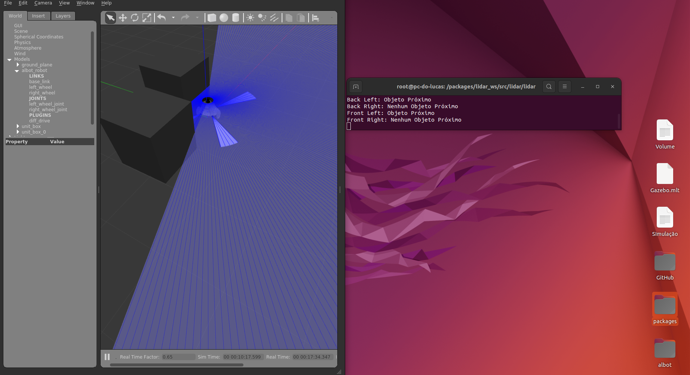

# SONAR

This script reads topics of type *Range* (sensor_msgs.msg library). The topics being read are:
- /distance/back_left_sonar
- /distance/back_right_sonar
- /distance/front_left_sonar
- /distance/front_right_sonar

The script checks at a frequency of 10Hz if there is an object close to the robot and always warns of this situation.

To carry out the script tests, I used the [Pequi-Mecanico-Home/albot](https://github.com/Pequi-Mecanico-Home/albot) project by user @Pequi-Mecanico-Home




script_name: sonar.py
package: sonar/


## Requirements
- ROS2

## Run
- Clone the repository as it contains the ROS2 package
- Do: ```colcon build # in your workspace```
- Do: ```source install/setup.bash # in your workspace```
- Do: ```ros2 run sonar sonar```

